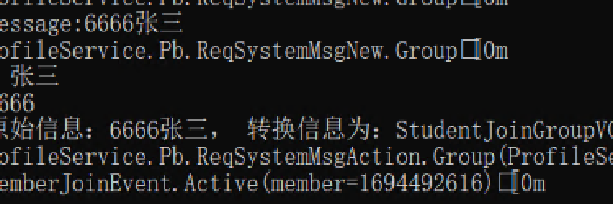
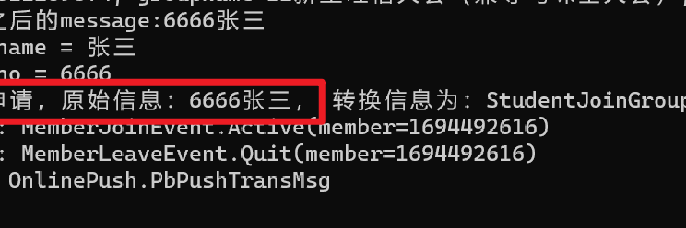
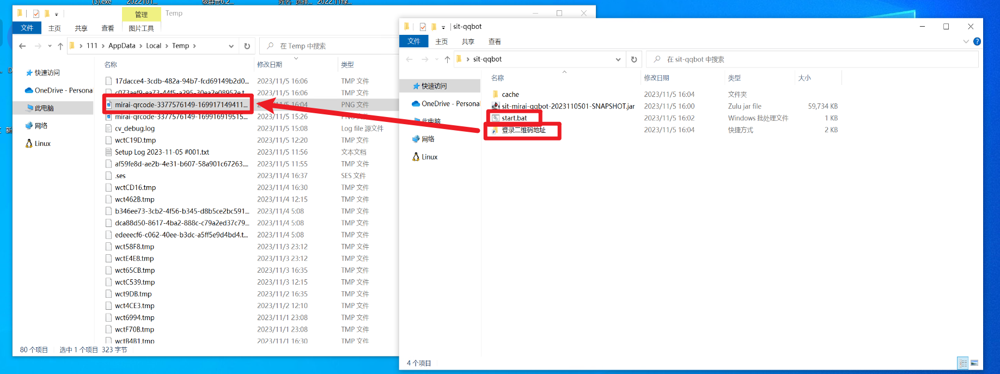

# 项目名称
基于mirai搭建的QQ群自动同意入群申请机器人（sit-mirai-qqbot）
# 项目背景
人工同意加入群聊，对人力消耗极大，需要人工判断该生是不是真的校内学生，判定也并不及时，
因此搭建一个基于mirai框架的机器人，能够自动同意学生入群申请是必要的
# 技术框架及版本
1. mirai:2.16.0
2. springboot:2.6.13
3. java:17
4. gradle:7.3.3
5. idea:2023.2
# 运行截图

# 运行步骤

1. 点开start.bat之后，
2. 打开登录二维码文件夹，找到最新的那个登录二维码
3. 用QQ扫码，就可以登录了

# 一些文档
1. https://github.com/mamoe/mirai/blob/dev/docs/EventList.md
2. https://github.com/KasukuSakura/mirai-login-solver-sakura
3. https://github.com/mamoe/mirai/blob/dev/docs/Events.md